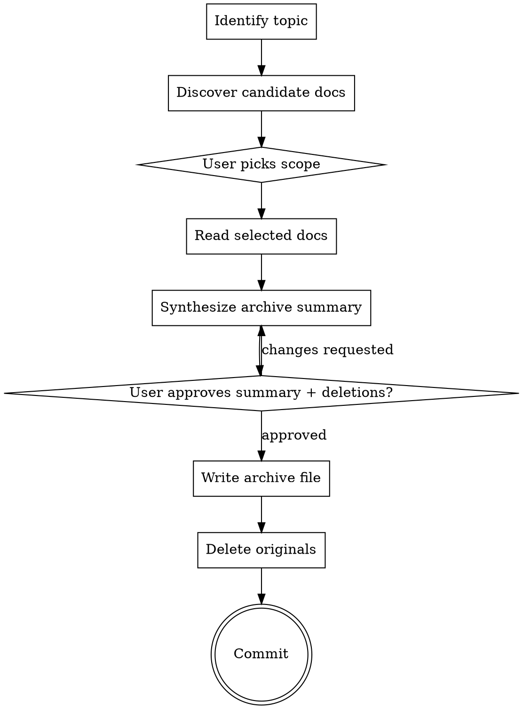

# Archive a Spec/Plan Pair

## Overview

This skill collapses a finished feature's planning artifacts (spec, plan, optional context, optional source PRD) into **one** summary document under `docs/harness-kit/archive/`, then deletes the originals. The goal is so that when someone later asks "why did we build X this way?", they read one short, distilled file instead of digging through three or four separate documents.

**Announce at start:** "I'm using the harness-kit:archive skill to archive these planning docs."

## Hard Gates

<HARD-GATE>
This skill **deletes** the original spec and plan files. You MUST get explicit user approval (Step 5) on both the proposed archive content **and** the file deletion list before touching any file. Never delete first and ask later.
</HARD-GATE>

<HARD-GATE>
Only invoke this skill when the user **explicitly** asks to archive. Do NOT auto-invoke from `harness-kit:finishing-a-development-branch`, `harness-kit:execute-plans`, or any other skill. The user decides when planning artifacts become history.
</HARD-GATE>

<HARD-GATE>
**PRDs under `docs/prds/` are never deleted by this skill**, even if the user explicitly asks to delete one. A PRD is an upstream source that may be referenced by multiple specs; deleting it would orphan unrelated work. If the user includes a PRD in the archive scope, treat it as **reference-only** — cite it in the archive's Sources section under "Sources kept (not deleted)" and leave the file untouched. If the user insists on deleting a PRD, refuse and tell them to do it manually outside this skill.
</HARD-GATE>

## Process Flow



## Workflow

### Step 1: Identify the Topic

Extract a topic slug from the user's request. Most often the user names a feature ("archive the init-cli docs"), a date ("archive the 2026-04-27 spec"), or hands you a path. Pick the most specific signal:

- **Path given** → use the filename's `YYYY-MM-DD-<topic>` portion verbatim.
- **Feature name given** → match it against existing spec/plan filenames.
- **Nothing specific** → ask the user one targeted question naming the matches you found, e.g. "I see two candidates: `2026-04-27-harness-kit-init-cli` and `2026-03-15-template-renderer`. Which one are you archiving?"

The slug becomes the archive file's name, so do not invent it. Strip type-suffixes like `-design`, `-plan`, etc. — the archive file is type-agnostic.

### Step 2: Discover Candidate Documents

Search these locations for files whose name contains the slug from Step 1. Use `Glob`, not `find`:

| Doc type | Canonical path                          | Fallback (legacy)                       |
| -------- | --------------------------------------- | --------------------------------------- |
| Spec     | `docs/harness-kit/specs/<slug>*`        | `docs/superpowers/specs/<slug>*`        |
| Plan     | `docs/harness-kit/plans/<slug>*`        | `docs/superpowers/plans/<slug>*`        |
| Context  | `docs/harness-kit/context/<slug>*`      | —                                       |
| PRD      | `docs/prds/*<slug-keywords>*`           | —                                       |

Read the headers (first ~30 lines) of every match to confirm it's actually about the same feature. A date-prefix collision is rare but possible.

If **no spec and no plan** is found, stop and tell the user: "No spec or plan matched `<slug>`. Nothing to archive." Do not proceed.

### Step 3: User Picks Scope

Present the discovered files as a checklist and let the user confirm which ones get folded into the archive. Use `AskQuestion` with `allow_multiple: true`. Pre-recommend including spec + plan (the core pair); leave context and PRD opt-in.

For each candidate, show:

- The path
- A one-line summary derived from its first heading or first paragraph
- Your recommendation (include / optional)
- **The fate of the original** — make this explicit so the user is never surprised in Step 5:
  - Spec / plan / context → "summarized into archive, **original deleted**"
  - PRD → "cited in archive Sources, **original kept**"

If the user wants to add a doc you didn't discover (e.g. a related design note), accept the path and add it. Treat any path under `docs/prds/` as PRD-class (reference-only) regardless of how the user labels it.

### Step 4: Read Selected Docs

Read each selected file **in full**. Do not skim. The whole point of this skill is to distill — you cannot distill what you have not read. Build a mental model of:

- Goal (from the spec)
- Approach / architecture (from spec + plan headers)
- Key decisions and trade-offs (often in spec sections like "Alternatives Considered")
- Files actually touched (from the plan's File Structure section)
- Constraints that shaped the work (from the spec's "Constraints" section, usually citing `.agents/rules.md`)
- Anything notable in the context doc (e.g. open questions that got resolved)

### Step 5: Synthesize the Archive Summary

Write the archive content using the template below. Aim for **one focused page** — short enough that a future reader will actually read it. If you find yourself pasting whole sections of the original spec, you're not distilling.

Then present the proposed archive content **inline in chat** along with two **separate** lists:

- **Archive path:** `docs/harness-kit/archive/YYYY-MM-DD-<slug>.md` (date is the spec's original date, not today's)
- **Files to delete:** every selected spec / plan / context path. Build this list by filtering the Step 3 selection: keep only paths under `docs/harness-kit/{specs,plans,context}/` or `docs/superpowers/{specs,plans}/`. **Never include any path under `docs/prds/`** — see the second HARD-GATE.
- **Files to keep (cited only):** every selected PRD path, plus any other doc the user explicitly marked reference-only.

Ask: "Approve archive write + deletions, or change something?"

**Wait for explicit approval.** If the user requests changes to the summary, revise and re-present. If the user asks to delete a PRD, refuse per the PRD HARD-GATE and re-present the same lists.

### Step 6: Write the Archive File

After approval, write the file to `docs/harness-kit/archive/YYYY-MM-DD-<slug>.md`. Create the `archive/` directory if it doesn't exist.

### Step 7: Delete the Originals

For each path approved for deletion in Step 5, just `rm` it. No need to use `git rm` — if the file was tracked, the deletion will be picked up in Step 8 by `git add -A`. If the file was untracked, `rm` is the only thing that works anyway.

```bash
rm <path>
```

Before each `rm`, sanity-check the path: it MUST sit under `docs/harness-kit/{specs,plans,context}/` or `docs/superpowers/{specs,plans}/`. If a path under `docs/prds/` somehow reached this step, abort the entire delete loop and report the bug — that's a HARD-GATE violation upstream and silently honoring it is worse than failing loudly.

### Step 8: Commit

Make a single commit covering the new archive file and the deletions. Use `git add -A` on the relevant paths so both the new archive and any deleted-but-tracked originals are staged:

```bash
git add -A docs/harness-kit/archive/YYYY-MM-DD-<slug>.md \
          docs/harness-kit/specs/ \
          docs/harness-kit/plans/ \
          docs/harness-kit/context/

git commit -m "docs(archive): archive <slug>

Summarize spec + plan into docs/harness-kit/archive/YYYY-MM-DD-<slug>.md
and remove originals. Implementation shipped; full history preserved
in git log."
```

If the user's project disallows committing from agents (check `.agents/rules.md`), skip the commit, stage the changes, and report the staged state to the user.

## Archive File Template

Use this structure verbatim. Keep section headings stable so future scripts can parse archives.

````markdown
# Archive: <topic title — human-readable, not the slug>

> Archived on `YYYY-MM-DD` by `harness-kit:archive`. Implementation shipped; this document supersedes the original spec and plan.

## Sources (deleted in archive commit)

| Type | Original Path | Recovery |
|------|---------------|----------|
| Spec | `docs/harness-kit/specs/YYYY-MM-DD-<slug>-design.md` | `git log --diff-filter=D -- <path>` |
| Plan | `docs/harness-kit/plans/YYYY-MM-DD-<slug>.md` | `git log --diff-filter=D -- <path>` |
| Context | `docs/harness-kit/context/YYYY-MM-DD-<slug>.md` | `git log --diff-filter=D -- <path>` |

## Sources kept (not deleted)

- PRD: `docs/prds/<file>.md` — referenced as the upstream requirement; this file is preserved because it may be cited by other specs.

## Goal

<1–2 sentences distilled from the spec's Goal section. State what was built and the problem it solved.>

## Final Approach

<3–6 sentences describing what actually shipped. Combine the spec's chosen design with the plan's architecture summary. Concrete: name the modules / packages / directories that own the behavior.>

## Key Decisions

- **<Decision name>** — <one sentence: what was chosen and the trade-off it accepted.>
- **<Decision name>** — <…>

## Files Introduced or Modified

| Path | Role |
|------|------|
| `<path>` | <one-line responsibility, copied or distilled from the plan's File Structure table> |

## Constraints Honored

- <Each non-negotiable rule from `.agents/rules.md` that the spec explicitly called out, e.g. "Templates inlined in code (rule 3)".>

## Notes for Future Readers

<Anything a maintainer in 6 months would actually want to know: known limitations, deliberate non-goals, follow-up work that was punted. One short paragraph or a few bullets — omit the section if there's nothing to say.>
````

## Anti-Patterns

- **Pasting whole sections of the spec** — the archive is a distillation. If you copy more than a paragraph verbatim, the archive failed its job. Future readers can `git show` the original.
- **Inventing facts** — if the spec doesn't say why a decision was made, do not guess. Either pull a real citation or omit the bullet.
- **Today's date in the filename** — use the spec's original date so chronology in `archive/` reflects when the work was designed, not when it was archived.
- **Deleting without approval** — never delete files before Step 5's approval, even if "the user already said go". The Step 5 message must list the exact paths.
- **Deleting a PRD** — PRDs under `docs/prds/` are upstream sources, not planning artifacts; they may be cited by other specs you have no visibility into. Even if the user explicitly asks "yes, delete the PRD too", refuse and tell them to delete it themselves outside this skill. This is a HARD-GATE, not a preference.
- **Auto-archiving** — this skill is user-initiated only. If `finishing-a-development-branch` or another skill ends and you feel the urge to archive, suppress it. Wait for the user.
- **Archiving in-progress work** — if the plan still has unchecked tasks (`- [ ]`), or the spec is marked `Status: Draft`, stop and ask the user "this looks unfinished — are you sure?". They might still say yes (e.g. abandoning the work), but the prompt forces a deliberate choice.
- **Renaming the slug** — the topic slug must come from the existing filenames, not from your interpretation of the feature. Renaming breaks the audit trail in git log.

## Integration

- **Triggered by:** the user, explicitly. No upstream skill auto-invokes this.
- **Reads from:** `docs/harness-kit/specs/`, `docs/harness-kit/plans/`, `docs/harness-kit/context/`, `docs/prds/`, with legacy fallbacks under `docs/superpowers/`.
- **Writes to:** `docs/harness-kit/archive/YYYY-MM-DD-<slug>.md`.
- **Sibling skills:**
  - `harness-kit:docs-round-tripping` — use this **instead** when docs and code disagree because of post-spec drift; archive is for *finished, accepted* work, not for fixing stale docs.
  - `harness-kit:finishing-a-development-branch` — runs at end of a dev branch; does not archive (deliberately separate concern).
