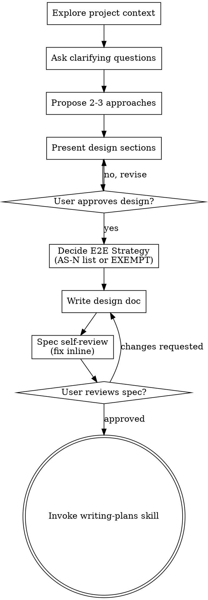

# Brainstorming Ideas Into Designs

Help turn ideas into fully formed designs and specs through natural collaborative dialogue.

Start by understanding the current project context, then ask questions one at a time to refine the idea. Once you understand what you're building, present the design and get user approval.

<HARD-GATE>
Do NOT invoke any implementation skill, write any code, scaffold any project, or take any implementation action until you have presented a design and the user has approved it. This applies to EVERY project regardless of perceived simplicity.
</HARD-GATE>

## Anti-Pattern: "This Is Too Simple To Need A Design"

Every project goes through this process. A todo list, a single-function utility, a config change — all of them. "Simple" projects are where unexamined assumptions cause the most wasted work. The design can be short (a few sentences for truly simple projects), but you MUST present it and get approval.

## Checklist

You MUST create a task for each of these items and complete them in order:

1. **Explore project context** — check files, docs, recent commits
2. **Ask clarifying questions** — one at a time, understand purpose/constraints/success criteria
3. **Propose 2-3 approaches** — with trade-offs and your recommendation
4. **Present design** — in sections scaled to their complexity, get user approval after each section
5. **Decide E2E Strategy** — does this feature have user-visible behavior (Web/Electron)? If yes, list `AS-N` Acceptance Scenarios; if no, mark `EXEMPT: <reason>`. This becomes a mandatory section in the spec — see "E2E Strategy Section" under "After the Design"
6. **Write design doc** — save to `docs/harness-kit/specs/YYYY-MM-DD-<topic>-design.md` (do NOT commit — the user decides whether and when to commit)
7. **Spec self-review** — quick inline check for placeholders, contradictions, ambiguity, scope (see below)
8. **User reviews written spec** — ask user to review the spec file before proceeding
9. **Transition to implementation** — invoke writing-plans skill to create implementation plan

## Process Flow



**The terminal state is invoking writing-plans.** Do NOT invoke frontend-design, mcp-builder, or any other implementation skill. The ONLY skill you invoke after brainstorming is writing-plans.

## The Process

**Understanding the idea:**

- Check out the current project state first (files, docs, recent commits)
- Before asking detailed questions, assess scope: if the request describes multiple independent subsystems (e.g., "build a platform with chat, file storage, billing, and analytics"), flag this immediately. Don't spend questions refining details of a project that needs to be decomposed first.
- If the project is too large for a single spec, help the user decompose into sub-projects: what are the independent pieces, how do they relate, what order should they be built? Then brainstorm the first sub-project through the normal design flow. Each sub-project gets its own spec → plan → implementation cycle.
- For appropriately-scoped projects, ask questions one at a time to refine the idea
- Prefer multiple choice questions when possible, but open-ended is fine too
- Only one question per message - if a topic needs more exploration, break it into multiple questions
- Focus on understanding: purpose, constraints, success criteria

**Exploring approaches:**

- Propose 2-3 different approaches with trade-offs
- Present options conversationally with your recommendation and reasoning
- Lead with your recommended option and explain why

**Presenting the design:**

- Once you believe you understand what you're building, present the design
- Scale each section to its complexity: a few sentences if straightforward, up to 200-300 words if nuanced
- Ask after each section whether it looks right so far
- Cover: architecture, components, data flow, error handling, testing
- Be ready to go back and clarify if something doesn't make sense

**Design for isolation and clarity:**

- Break the system into smaller units that each have one clear purpose, communicate through well-defined interfaces, and can be understood and tested independently
- For each unit, you should be able to answer: what does it do, how do you use it, and what does it depend on?
- Can someone understand what a unit does without reading its internals? Can you change the internals without breaking consumers? If not, the boundaries need work.
- Smaller, well-bounded units are also easier for you to work with - you reason better about code you can hold in context at once, and your edits are more reliable when files are focused. When a file grows large, that's often a signal that it's doing too much.

**Working in existing codebases:**

- Explore the current structure before proposing changes. Follow existing patterns.
- Where existing code has problems that affect the work (e.g., a file that's grown too large, unclear boundaries, tangled responsibilities), include targeted improvements as part of the design - the way a good developer improves code they're working in.
- Don't propose unrelated refactoring. Stay focused on what serves the current goal.

## After the Design

**Documentation:**

- Write the validated design (spec) to `docs/harness-kit/specs/YYYY-MM-DD-<topic>-design.md`
  - (User preferences for spec location override this default)
- Use elements-of-style:writing-clearly-and-concisely skill if available
- **Do NOT commit the design document yourself.** Tell the user the file is written and suggest a commit command (see "User Review Gate" below). The user decides whether to commit, when, and with what message.

**E2E Strategy Section (mandatory in every spec):**

Every spec must include an `## E2E Strategy` section, even if the answer is "no e2e". This section is what `harness-kit:writing-plans` reads to decide whether to schedule Outside-In tasks via `harness-kit:e2e-testing`. Use one of these two forms:

```markdown
## E2E Strategy

- AS-1: <Given/When/Then sentence describing one user-visible scenario>
- AS-2: <another scenario, e.g. an error / edge state>
- AS-3: ...
```

Or, if the feature has no user-visible behavior:

```markdown
## E2E Strategy

EXEMPT: <one-line reason — e.g. "pure backend API consumed only by other services", "internal CLI tool with no UI", "build script with no runtime UI">
```

Rules:

- Empty section / no section / "TBD" / "to be decided" — all forbidden. `harness-kit:writing-plans` will refuse to proceed and bounce the spec back here.
- AS-N labels are sequential within the feature (`AS-1`, `AS-2`, ...) and become the dispatch keys in `tests/e2e/<feature>.sh AS-N`. Gaps allowed if you remove a scenario during revision.
- Every error / edge state from the design that has a user-visible signal gets its own AS — don't bury "and on bad input show this error" inside the happy-path AS.
- For destructive flows (account deletion, sending real emails, etc.), call them out explicitly in the AS text — `harness-kit:e2e-testing` has a special two-phase confirmation gate for these.

If you (during step 5 of the checklist) find the feature has user-visible behavior but you can't produce concrete AS-N statements, that's a sign the design isn't done — go back and refine.

**Spec Self-Review:**
After writing the spec document, look at it with fresh eyes:

1. **Placeholder scan:** Any "TBD", "TODO", incomplete sections, or vague requirements? Fix them.
2. **Internal consistency:** Do any sections contradict each other? Does the architecture match the feature descriptions?
3. **Scope check:** Is this focused enough for a single implementation plan, or does it need decomposition?
4. **Ambiguity check:** Could any requirement be interpreted two different ways? If so, pick one and make it explicit.
5. **E2E Strategy presence:** Is there a `## E2E Strategy` section with either a non-empty `AS-N` list OR `EXEMPT: <reason>`? If missing or empty, fix before handing off — `writing-plans` will reject otherwise.

Fix any issues inline. No need to re-review — just fix and move on.

**User Review Gate:**
After the spec review loop passes, ask the user to review the written spec before proceeding. Use this format so the user has everything they need to decide on a commit:

> Spec written to `<path>` (not committed).
>
> **Files changed:**
> - `<path>` (new)
>
> **Suggested commit (run yourself if you want it):**
>
> ```bash
> git add <path>
> git commit -m "docs(spec): <one-line topic summary>"
> ```
>
> Please review the spec and let me know if you want to make any changes before we start writing out the implementation plan.

Wait for the user's response. If they request changes, make them and re-run the spec review loop. Only proceed once the user approves. Whether they commit (now, later, or never) is their call — do not commit on their behalf unless they explicitly ask.

**Implementation:**

- With the general project context produced by `harness-kit:context-acquiring` skill, invoke the writing-plans skill to create a detailed implementation plan
- Do NOT invoke any other skill. writing-plans is the next step.

## Key Principles

- **One question at a time** - Don't overwhelm with multiple questions
- **Multiple choice preferred** - Easier to answer than open-ended when possible
- **YAGNI ruthlessly** - Remove unnecessary features from all designs
- **Explore alternatives** - Always propose 2-3 approaches before settling
- **Incremental validation** - Present design, get approval before moving on
- **Be flexible** - Go back and clarify when something doesn't make sense
