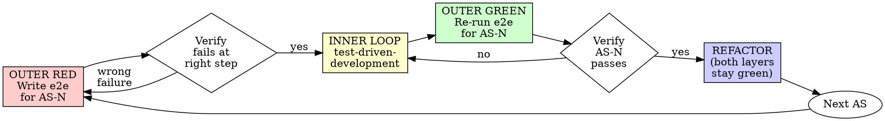

# E2E Testing (Outside-In TDD)

## Overview

This is the **outer** TDD loop. The inner loop is `harness-kit:test-driven-development` (unit tests). Together they form Outside-In TDD:

```
RED (e2e: AS-N fails)
  └─ inner loop: test-driven-development
        └─ unit RED → unit GREEN → REFACTOR
              └─ repeat until functionality is in place
GREEN (e2e: AS-N passes)
REFACTOR
```

**Core principle:** No user-visible behavior code without a failing acceptance scenario first.

**Violating the letter of this rule is violating the spirit of this rule.**

This skill never embeds raw `agent-browser` commands. The browser/desktop capability is loaded fresh from agent-browser's own discovery stub so that instructions never go stale across versions.

## Terminology

- **AS-N** — *Acceptance Scenario number N*. Each `AS-N` is one Given/When/Then bullet listed in the spec's `## E2E Strategy` section, produced by `harness-kit:brainstorm`. Examples: `AS-1`, `AS-2`, `AS-3`. The label is also the dispatch key in the e2e script: `./tests/e2e/<feature>.sh AS-1` runs only the AS-1 branch. Numbering is sequential within a single feature; gaps are allowed if a scenario is removed during brainstorm revision.
- **Outside-In TDD** — outer e2e Red-Green-Refactor loop wrapping the inner unit Red-Green-Refactor loop from `harness-kit:test-driven-development`. The outer loop drives "what does the user see", the inner loop drives "how does the code work".
- **OUTER RED / OUTER GREEN** — the e2e (outer) phase of the cycle. Capitalised and prefixed `OUTER` to disambiguate from the inner unit-test RED/GREEN that `harness-kit:test-driven-development` owns.
- **Evidence** — anything written under `tests/e2e/.evidence/<feature>/<timestamp>-AS-N/` during a run: screenshots, a11y snapshots, video, and a `result.txt` with the exit code and last failing step.
- **Connection failure** — agent-browser cannot attach to a running Chrome (Mode A) **or** Chrome is up but the target app is unreachable (Mode B). Neither is a valid OUTER RED — see the **Connection Failure Protocol** section below.
- **`--auto-connect`** — the agent-browser flag that attaches to the user's already-running Chrome instead of spawning a fresh one. Mandatory on every `agent-browser` invocation in an e2e script. Codified as `AB_FLAGS` in the script skeleton. See the **Loading agent-browser** and **Browser Session Strategy** sections.
- **Subagent execution** — this skill always runs inside a Task-tool subagent dispatched by the parent agent with the literal marker `e2e-subagent` in the prompt. The subagent returns a single JSON report; the parent agent never reads the evidence dir directly. See the **Subagent Execution** section below.
- **Destructive action** — anything that, executed against the user's real account, would be costly or impossible to undo (delete, send, charge, revoke, force-push, drop, etc.). Always gated behind explicit `proceed-destructive` confirmation. See the **Browser Session Strategy** section below.

## When to Use

**Always**, when the spec's `## E2E Strategy` section lists `AS-N` scenarios:
- New Web UI feature
- New Electron desktop app feature
- Bug fix with a user-visible reproduction path
- Behavior change visible in the UI

**Skip** when the spec's `## E2E Strategy` section is marked `EXEMPT: <reason>` (e.g. pure backend API, internal CLI, batch script). The exemption must already be approved during `harness-kit:brainstorm`.

If the spec has no `## E2E Strategy` section at all: **STOP**. Send the work back to `harness-kit:brainstorm` to fill it in. Do not invent scenarios on the fly.

## The Iron Law

```
NO USER-VISIBLE BEHAVIOR CODE WITHOUT A FAILING E2E SCENARIO FIRST
```

Wrote UI code before the e2e scenario? Same remedy as inner TDD: delete it, start over from the scenario.

**No exceptions:**
- Don't keep the UI code as "reference"
- Don't "adapt" it while writing the scenario
- Don't look at it
- Delete means delete

## Loading agent-browser

Never hardcode `agent-browser` subcommands or flag syntax in this skill, in scripts, or in plans. Always load the live workflow content first:

```bash
# For Web targets (default)
agent-browser skills get core

# For Electron desktop targets (VS Code, Slack, Discord, Figma, ...)
agent-browser skills get core
agent-browser skills get electron
```

Then follow the workflow content returned by those calls. If you find yourself writing an `agent-browser` invocation from memory without having just run `skills get core` in the session, **stop and load it**.

### Mandatory `--auto-connect`

Every `agent-browser` invocation in an e2e script MUST include the `--auto-connect` flag (or whatever the equivalent attach-to-running-Chrome flag is in the version installed — verify via `agent-browser skills get core`). This attaches to the user's already-running Chrome instance instead of spawning a fresh one. The trade-off this enables (sharing the user's logged-in state) is documented in **Browser Session Strategy** below — make sure you've read that section before you start.

In scripts, codify this as a single variable so it can never be forgotten on individual calls:

```bash
AB_FLAGS="--auto-connect"
agent-browser ${AB_FLAGS} <subcommand> ...
```

Never call `agent-browser` in an e2e script without `${AB_FLAGS}`. If a particular subcommand fails with `--auto-connect`, that's a bug to surface (re-load `agent-browser skills get core`), not a reason to drop the flag.

## Subagent Execution

This skill MUST execute inside a subagent, never directly in the parent agent's context. The reasons:

- **Context hygiene** — e2e runs dump screenshots, video paths, a11y trees, and verbose CLI output. Letting that into the parent context blocks it from doing other work.
- **CLI containment** — agent-browser commands are loaded from `agent-browser skills get core` and are version-specific. The parent agent shouldn't "learn" them and risk re-using them inappropriately later.
- **Failure isolation** — a flaky or hanging e2e shouldn't take down the parent's planning state.

### Self-Check on Entry

When the e2e-testing skill is invoked, the first check is:

```
Am I the parent agent or a subagent dispatched to run e2e?
```

The dispatcher (parent) passes the marker string `e2e-subagent` somewhere in the subagent's prompt. The check is therefore:

- If the prompt that brought me here contains the literal `e2e-subagent` marker → I am the subagent, proceed with the Outside-In Cycle.
- Otherwise → I am the parent, **stop and dispatch** before doing anything else.

### Dispatch Procedure (parent agent)

When you (parent) need to run e2e for one or more `AS-N`:

1. Pick a `subagent_type`:
   - **`shell`** (default) — when the script already exists and you only need to run it
   - **`generalPurpose`** — when the subagent must read the spec, write/extend `tests/e2e/<feature>.sh`, or do anything beyond shell execution
2. Build the dispatch prompt — see [`subagent-protocol.md → Dispatch Prompt Template`](./subagent-protocol.md#dispatch-prompt-template). The prompt must contain the `e2e-subagent` marker, this skill's full path, the feature name, the exact `AS-N` list, and the path to the spec's `## E2E Strategy` section.
3. Wait for the subagent's JSON report.
4. Interpret the report per [`subagent-protocol.md → Parent's Handling Rules`](./subagent-protocol.md#parents-handling-rules) — typically that means passing it into `harness-kit:verification-before-completion`, but `AWAITING_DESTRUCTIVE_ACK` triggers the two-phase flow in `destructive-gate-protocol.md`.

### Subagent Report — at a glance

The subagent returns ONE JSON block with `feature`, `scenarios[]` (each with `as`, `exit_code`, `evidence_dir`, `phase`, `failing_step`, `destructive_pending`), `auto_connect_used`, `destructive_actions_attempted`, `notes`. Full schema, field rules, and parent handling matrix live in [`subagent-protocol.md`](./subagent-protocol.md).

Hard invariants (reject the report otherwise):
- `auto_connect_used` MUST be `true`
- `exit_code` is `null` ONLY when `phase == AWAITING_DESTRUCTIVE_ACK`
- The parent never reads the evidence directory itself — the JSON is the contract

## Outside-In Cycle



### OUTER RED — Write the failing scenario

Pick **one** `AS-N` from the spec. Write only the branch of the script that drives that scenario. Cover both happy path and the spec-defined error states for that AS — never just the happy path.

### Verify OUTER RED — Watch it fail at the right step

**MANDATORY. Never skip.**

```bash
./tests/e2e/<feature>.sh AS-N
```

Confirm:
- Script exits non-zero
- Failure happens at the step you expected (e.g. "element `Submit` not found", not "could not connect to localhost:3000")
- If the failure is a connection error, see **Connection Failure Protocol** below — a connection failure is not a valid OUTER RED.

**Test passes immediately?** You're testing existing behavior. Fix the scenario.

**Test fails for the wrong reason?** Fix the scenario or the environment, not the production code.

### INNER LOOP — Drive the implementation with unit TDD

Hand off to `harness-kit:test-driven-development`. Follow its Red-Green-Refactor cycle until the functionality the scenario needs is in place. Do not touch the e2e script during this phase.

### OUTER GREEN — Re-run the scenario

```bash
./tests/e2e/<feature>.sh AS-N
```

Confirm:
- Exit 0
- Output pristine (no warnings, no leftover errors)
- Other AS-M scenarios that previously passed still pass

**Still fails?** Back to the inner loop. Don't patch the e2e script.

### REFACTOR

Clean up both layers. Keep both green. Don't add behavior.

### Repeat

Next `AS-N` from the spec, until the spec's `## E2E Strategy` list is exhausted.

## Script Convention

| Item | Value |
|---|---|
| Path | `tests/e2e/<feature>.sh` |
| One file per | feature (not per scenario) |
| Scenario dispatch | first positional argument: `AS-N` |
| Exit code | 0 = all assertions for that AS passed; non-zero = failed |
| Evidence dir | `tests/e2e/.evidence/<feature>/<UTC-timestamp>/` |
| Re-runnable | yes — must be safe to call twice in a row |
| Side effects on real systems | possible by design (`--auto-connect` shares user state) — every destructive call MUST go through the confirmation gate (see **Browser Session Strategy**) |

Single-AS invocation is the only supported form. There is no "run all scenarios" mode at the script level — that is `harness-kit:finishing-a-development-branch`'s job (it iterates `AS-N` from the spec).

## Script Skeleton

To scaffold `tests/e2e/<feature>.sh`, copy the template (path is relative to wherever this skill is installed):

```bash
SKILL_DIR=$(dirname "$(readlink -f "<path-to-this-SKILL.md>")")
mkdir -p tests/e2e
cp "${SKILL_DIR}/templates/feature.sh.template" "tests/e2e/<feature>.sh"
chmod +x "tests/e2e/<feature>.sh"
# then replace `<feature>` placeholders inside the file
```

The template ships with: `set -euo pipefail`, the evidence-dir setup, `AB_FLAGS="--auto-connect"`, the `_destructive_gate` helper (with `E2E_TS_OVERRIDE` support for Phase 2 re-dispatch), and a `case` skeleton with `AS-1`/`AS-2` placeholders.

Once copied: replace each `<feature>` placeholder, then fill `case` branches with `agent-browser` calls — load the current syntax via `agent-browser skills get core`. Every call must include `${AB_FLAGS}`.

## Connection Failure Protocol

A connection failure is **not a valid OUTER RED**. The skill does not start, restart, or babysit anything.

There are two distinct failure modes; the protocol is the same but the message changes:

**Mode A — Chrome itself isn't running (or `--auto-connect` can't attach):**

```
E2E for <feature> AS-N cannot proceed: agent-browser --auto-connect
could not attach to a running Chrome instance.

Please launch Chrome with the remote-debugging port enabled (the
exact command is documented in `agent-browser skills get core`).

If you want me to use a dedicated profile (recommended), see Hard
Rule 2 in Browser Session Strategy.

Reply `continue` once Chrome is up. I will not start Chrome for
you (your existing windows / login sessions are yours to manage).
```

**Mode B — Chrome is up, but the target app is unreachable:**

```
E2E for <feature> AS-N cannot proceed: agent-browser is attached
to Chrome but cannot reach <target> (e.g. http://localhost:3000,
the Electron process named "<app>", a remote URL).

Please start the application and reply `continue` once it's up.
I will not run `npm run dev`, `yarn start`, `electron .`, or
`docker compose up` for you (avoids polluting your shell and
hiding port collisions).
```

**Procedure (both modes):**

1. **STOP** the e2e cycle immediately.
2. Output the appropriate message above (the subagent puts this in `notes` of its JSON report; the parent agent surfaces it to the user).
3. Wait for the user's `continue`.
4. Re-run the same `./tests/e2e/<feature>.sh AS-N`. If it still fails to connect, repeat the message — do not switch into "let me help debug your environment" mode unless the user explicitly asks.

## Evidence

Every run of `./tests/e2e/<feature>.sh AS-N` writes into `tests/e2e/.evidence/<feature>/<timestamp>-AS-N/`:
- Screenshots at every assertion boundary (both pass and fail)
- A11y snapshots on failure
- Video recording (if agent-browser is configured for it)
- A plain-text `result.txt` with the exit code and the last failing step description

This directory is the **only** acceptable evidence that a scenario "just ran" — `harness-kit:verification-before-completion` will check the latest timestamp under it before accepting any "feature complete" claim.

**Retention rules:**
- Stays on disk during the entire feature's development.
- Never enters git (see **First-Run Setup** below).
- Cleaned up only by `harness-kit:finishing-a-development-branch` Step 5.5, with explicit user confirmation (`cleanup-evidence` / `keep`). Sleeves of unconfirmed evidence accumulate across features — that is intentional. The user is the only one who decides when an investigation is "done".

## First-Run Setup

Before creating `tests/e2e/<feature>.sh` for the first time in a project, agent must verify the project's `.gitignore` excludes the evidence directory.

**Procedure:**

1. Read the project's root `.gitignore` (create the file if it does not exist).
2. Check whether it contains a line that excludes `tests/e2e/.evidence/` (exact match, or a broader pattern such as `tests/e2e/.evidence` or `**/.evidence/`).
3. If **yes**: proceed to scaffold the script.
4. If **no**: ask the user, verbatim:

   > `tests/e2e/.evidence/` is not in `.gitignore`. E2E evidence (screenshots, videos, a11y snapshots) must not enter git. I'm about to append the following line to `.gitignore`:
   >
   > ```
   > tests/e2e/.evidence/
   > ```
   >
   > OK to append? (yes / no)

5. On `yes`: append the line and the comment `# harness-kit:e2e-testing — runtime evidence, never commit`. Commit `.gitignore` separately from any feature code.
6. On `no`: **do not** create the script. Tell the user:

   > Cannot proceed without the gitignore entry — running e2e would dirty the working tree with binary artifacts. Please either approve the append or add an equivalent rule yourself, then re-invoke.

This is a one-time setup per project. Subsequent features reuse the same line.

## Browser Session Strategy

E2E in this skill attaches to the **user's already-running Chrome** via `--auto-connect`. This is a deliberate trade-off the user opted into:

**What you get:**
- Existing logged-in state (Gmail, GitHub, Slack, the app under test, etc.) is reused — no fixture-user setup boilerplate.
- The browser the user is testing in is the same browser the user develops in — no "but it works in my dedicated test browser" drift.
- `--auto-connect` is fast: no fresh Chrome boot per run.

**What you accept:**
- The agent has access to **every site the user is logged into in that Chrome**. That includes their real Gmail, real bank, real production accounts.
- Side effects from e2e scenarios hit **real data** unless the AS is explicitly designed against a sandbox URL / tenant / fixture record.
- A buggy AS can damage real state.

Because of this, the following hard rules replace the old "isolated session" model:

### Hard Rule 1 — Destructive Action Confirmation Gate (two-phase dispatch)

A destructive action is anything that, executed against the user's real account, would be costly or impossible to undo: deleting an account/repo/document/file, sending a real email/message/payment, revoking access, rotating keys, force-pushing, dropping a table, any DELETE-on-prod call.

If you can write the AS without any destructive action — **do**. The gate exists only for scenarios where the AS itself describes a destructive user-visible flow ("user deletes their account and is logged out").

**The protocol in one paragraph:** every destructive line is preceded by `_destructive_gate "<desc>" "<resource>"` (helper ships in `templates/feature.sh.template`). On Phase 1, the helper emits `DESTRUCTIVE_GATE: ...` to stdout and `exit 75` (EX_TEMPFAIL); the subagent reports `phase: "AWAITING_DESTRUCTIVE_ACK"` with the `ack_token`; the parent surfaces the request to the user; the user replies with the literal `proceed-destructive <ack_token>`; the parent re-dispatches with `E2E_DESTRUCTIVE_ACK=<token>` (and `E2E_TS_OVERRIDE=<original-ts>`) so the helper matches and the destructive line runs.

Full protocol — script / subagent / parent sides, edge cases, common failure modes — lives in [`destructive-gate-protocol.md`](./destructive-gate-protocol.md). Read that file before implementing or debugging a destructive AS.

Multiple destructive gates in one AS = multiple round-trips. Each gate gets its own token. That's intentional — agreeing to delete an account does not transitively authorize deleting their org five steps later.

### Hard Rule 2 — Recommend a Separate Chrome Profile

In **First-Run Setup** (see below), when the skill is first used in a project, also tell the user:

> Strong recommendation: launch the Chrome you intend to use for e2e with a profile dedicated to development (`google-chrome --user-data-dir=~/.chrome-e2e --remote-debugging-port=...`). `--auto-connect` will attach to whichever Chrome exposes the debugging port; using a dedicated profile means a careless AS can't touch your personal Gmail/Slack/etc.
>
> This is a recommendation, not a requirement — the project chose `--auto-connect` so it can also attach to your daily Chrome if that's what you want.

Do not refuse to proceed if the user declines the separate profile. Just record `notes: "user attached to default Chrome profile"` in the report so the auditor knows.

### Hard Rule 3 — No Vault Credential Theft

The agent MUST NOT read, copy, or echo any credential out of agent-browser's auth vault, the OS keyring, the Chrome password manager, or any cookie store, regardless of who asks. If a scenario seems to require it, stop and ask the user; the legitimate path is for the user to type / paste the credential themselves into the running Chrome.

## Anti-Patterns

When writing or changing e2e scripts, read [`e2e-anti-patterns.md`](./e2e-anti-patterns.md) for the full list. The most lethal ones:

- Using `sleep` to wait for UI (use a11y / element-wait primitives from `agent-browser skills get core`)
- Hardcoded pixel coordinates or CSS-selector / xpath fallbacks
- Mocking the network layer inside an e2e (defeats the purpose)
- Asserting only the happy path
- Calling `agent-browser` without `${AB_FLAGS}` (drops `--auto-connect`)
- Performing a destructive action without going through the confirmation gate
- Reading credentials out of the auth vault / Chrome password manager
- Running e2e in the parent agent's context instead of dispatching to a subagent
- Calling the script `./tests/e2e/<feature>.sh` with no `AS-N` arg "to run everything"

## Verification Checklist

Before declaring an `AS-N` done:

- [ ] Spec's `## E2E Strategy` lists this `AS-N`
- [ ] e2e-testing was running in a subagent dispatched with the `e2e-subagent` marker (parent did NOT run it inline)
- [ ] Loaded the current agent-browser workflow (`agent-browser skills get core` and, for Electron, `... electron`) in this session
- [ ] Every `agent-browser` invocation in the script uses `${AB_FLAGS}` (= `--auto-connect`)
- [ ] Wrote the script branch first, watched it fail
- [ ] Failure was at the expected step, not a connection error
- [ ] Hand-off to `harness-kit:test-driven-development` for the inner loop happened explicitly
- [ ] Re-ran the script after the inner loop, saw exit 0
- [ ] Other previously-green `AS-M` scenarios still pass
- [ ] Evidence dir for this run exists under `tests/e2e/.evidence/<feature>/`
- [ ] `.gitignore` covers `tests/e2e/.evidence/`
- [ ] No `agent-browser` syntax invented from memory — every command came from `skills get core` content read in this session
- [ ] Any destructive action went through the confirmation gate; `destructive_actions_attempted` accurately reflects what happened
- [ ] Subagent's JSON report has `auto_connect_used: true`
- [ ] No vault / password-manager / cookie credential was read or echoed

Cannot check all boxes? You skipped the discipline. Restart from OUTER RED.

## Common Rationalizations

| Excuse | Reality |
|---|---|
| "I'll write the e2e after the UI works" | E2e written after the UI passes immediately. Proves nothing. Same trap as inner-TDD-after. |
| "Connection error counts as RED" | No. Connection error = environment broken. RED means the assertion you wrote was reached and failed. |
| "I'll just `npm run dev` myself, faster than asking" | Pollutes the user's shell, hides port collisions, breaks the user's expectation that you don't take over their dev loop. STOP and ask. |
| "Evidence is just clutter, let me delete it now" | Cleanup is the user's decision and only happens during `finishing-a-development-branch`. Premature deletion destroys debugging trails. |
| "I'll mock the API, the UI is what matters" | Then it's not e2e. It's a component test. Use unit TDD for that. |
| "CSS selector is more reliable than a11y" | If a11y can't find it, the UI has an accessibility bug — fix the UI, not the test. |
| "One scenario covers everything, splitting is overkill" | Per-AS dispatch is what makes failures localizable and re-runnable. Keep the `case`. |
| "I remember the agent-browser flag" | Skills evolve. Re-load `agent-browser skills get core` every session. |
| "I'll skip `--auto-connect` just for this one call" | Then you're spawning a fresh Chrome the user didn't ask for, the AS executes against a different state than the user sees, and the report `auto_connect_used: false` will be rejected. Use `${AB_FLAGS}`. |
| "I'll just run e2e here, dispatching is overhead" | The reason the rule exists IS the overhead — keeping screenshots, video paths, and CLI dumps out of the parent context. Dispatch. |
| "The destructive action is obviously safe, I'll skip the gate" | "Obviously safe" against the user's real Gmail / GitHub / bank account is exactly the famous-last-words category. Gate it. |
| "I'll grab the cookie / token from the vault, it's faster" | No. The user typed it once into Chrome; the running browser already has it. Read nothing. |

## Red Flags — STOP

- About to write UI/Electron production code without an `AS-N` script branch failing first
- About to start Chrome / dev server / Electron process yourself
- About to commit anything under `tests/e2e/.evidence/`
- About to call `agent-browser` without `${AB_FLAGS}`
- About to perform a destructive action without going through the confirmation gate
- About to read or echo a credential from the vault / password manager / cookie store
- Currently in the parent agent context with no `e2e-subagent` marker, but about to execute the Outside-In Cycle inline
- Wrote `agent-browser ...` without loading `skills get core` in this session
- Connection error treated as RED
- Script created without checking `.gitignore`

All of these mean: stop, undo, restart from the right step.

## Integration

**Called by:**
- `harness-kit:execute-plans` — when the plan's outer task type is e2e (Outside-In template)

**Calls:**
- `harness-kit:test-driven-development` — for the inner loop
- agent-browser CLI — `agent-browser skills get core` (always), `... electron` (when target is Electron)

**Inputs from:**
- `harness-kit:brainstorm` — produces the spec's `## E2E Strategy` section with the `AS-N` list (or `EXEMPT`)
- `harness-kit:writing-plans` — wraps each `AS-N` into an Outside-In task block

**Outputs consumed by:**
- `harness-kit:verification-before-completion` — checks evidence dir for fresh runs of every `AS-N`
- `harness-kit:finishing-a-development-branch` — Step 1.5 re-runs all `AS-N`; Step 5.5 cleans evidence with confirmation

## The Bottom Line

**Outer RED before user-visible code. Real browser, real assertions, real evidence.**

If the e2e script ever passes immediately, or if you ever start the user's dev server for them, or if evidence ever lands in git — you broke the discipline. Stop and reset.
